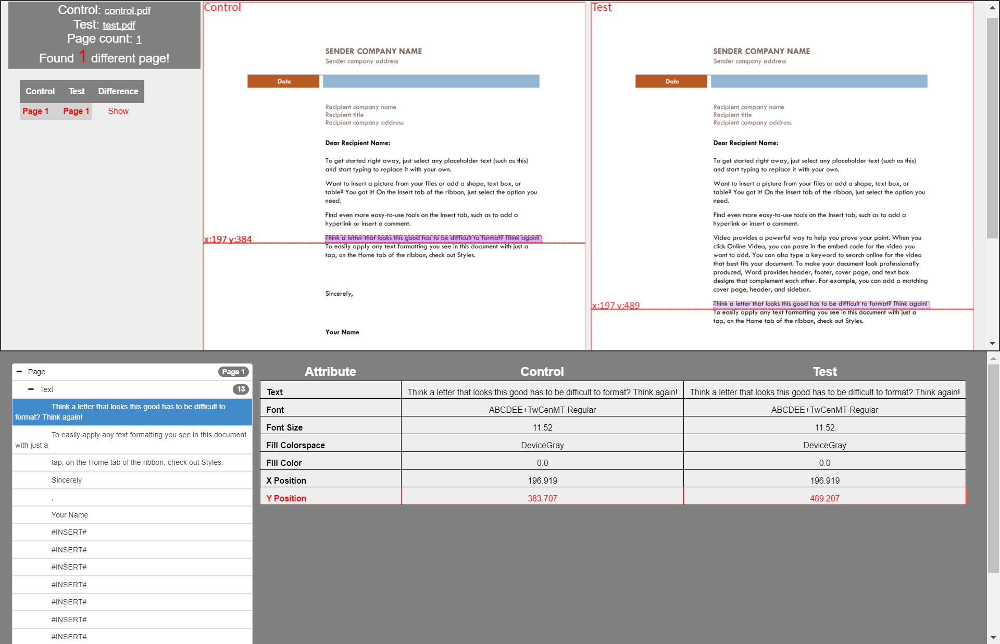
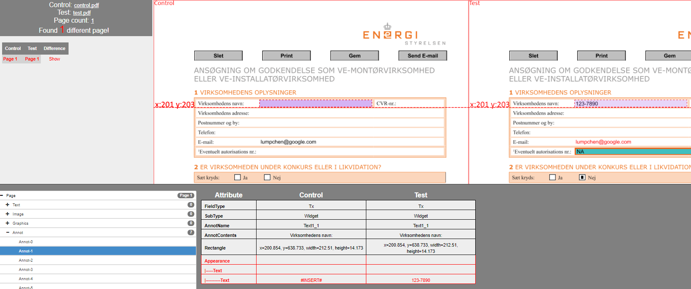

# xdiff.ncc
A PDL file comparison tool, support comparison of PDF, Postscript and AFP documents. xdiff.ncc not only compares rendering bitmap of each page, but also analyzes and compares all contents in each page. For [detail](https://lumpchen.github.io/xdiff.ncc/), see showcase below.  
   

## Showcase
https://lumpchen.github.io/xdiff.ncc/

Testcase | Control | Test | Report
------------ | ------------- | ------------- | ------------- 
simple text | [control.pdf](./src/test/resources/testcases/xdiff/text/text_insert/control.pdf) | [test.pdf](./src/test/resources/testcases/xdiff/text/text_insert/test.pdf) | [report.html](./src/test/resources/testcases/xdiff/text/text_insert/report/report.html)
simple image | [control.pdf](./src/test/resources/testcases/xdiff/image/simple/control.pdf) | [test.pdf](./src/test/resources/testcases/xdiff/image/simple/test.pdf) | [report.html](./src/test/resources/testcases/xdiff/image/simple/report/report.html)
table | [control.pdf](./src/test/resources/testcases/xdiff/graphics/table/control.pdf) | [test.pdf](./src/test/resources/testcases/xdiff/graphics/table/test.pdf) | [report.html](./src/test/resources/testcases/xdiff/graphics/table/report/report.html)
form control | [control.pdf](./src/test/resources/testcases/xdiff/annot/form_control/control.pdf) | [test.pdf](./src/test/resources/testcases/xdiff/annot/form_control/test.pdf) | [report.html](./src/test/resources/testcases/xdiff/annot/form_control/report/report.html)
Indesign forms | [control.pdf](./src/test/resources/testcases/xdiff/annot/indd_forms/control.pdf) | [test.pdf](./src/test/resources/testcases/xdiff/annot/indd_forms/test.pdf) | [report.html](./src/test/resources/testcases/xdiff/annot/indd_forms/report/report.html)
misc | [control.pdf](./src/test/resources/testcases/xdiff/misc/simple/control.pdf) | [test.pdf](./src/test/resources/testcases/xdiff/misc/simple/test.pdf) | [report.html](./src/test/resources/testcases/xdiff/misc/simple/report/report.html)

Maven
----
    <dependency>
        <groupId>com.github.lumpchen</groupId>
        <artifactId>xdiff.ncc</artifactId>
        <version>0.9.2</version>
    </dependency>

How To Use
----
    import me.lumpchen.xdiff.DiffSetting;
    import me.lumpchen.xdiff.XDiff

    public class Test {
        public static void main(String[] args) {
            File control = "path_to_control_pdf";
            File test = "path_to_test_pdf";
            File reportDir = "path_to_report_dir";
            
            DiffSetting diffSetting = DiffSetting.getDefaultSetting();
            diffSetting.compSetting.ignoreDifferentTextStyle = true;

            int res = XDiff.diff(control, test, reportDir, diffSetting);
        }
    }
For more samples, see https://github.com/lumpchen/xdiff.ncc/tree/master/src/test/java/me/lumpchen/xdiff

Diff Parameters
----
    resolution = 96
    previewImageFormat = png
    noReportOnSameResult = false
    printReport = false
    showDifferentPagesOnly = false
    
    enableCompareImage = true
    enableComparePath = true
    enableMergePath = true
    enableCompareAnnots = true
    enableTextPositionCompare = true
    enableImageAppearanceCompare = false
    enableAnnotAppearanceCompare = true
    enablePathPixelCompare = false
    
    # Global Tolerance
    toleranceOfHorPosition = 1
    toleranceOfVerPosition = 1	
    
    # Frame size Tolerance
    toleranceOfRectWidth = 1
    toleranceOfRectHeight = 1
    
    ignoreZeroSizeArea = true
    # Ignore graphics which is white color filling or stroking and no graphics for comparison.
    ignoreInvisibleGraphics = false
    # Ignore text consisting of invisible characters, such as text consisting of consecutive spaces
    ignoreInvisibleText = false
    
    # If true, the comparison algorithm would compare contents according to the order inside page contents.
    # Default as false, maybe helpful for PDFs produced by Indesign 
    disableLineBreaking = false
    
    # Spacing Between Words
    # Determining whether a space should be inserted
    scaleOfSpaceingBetweenWords = 0.5
    
    # Diff image background color, support BLACK WHITE RED GREEN BLUE CYAN MAGENTA YELLOW
    diffBitmapBackground = BLACK
    
    # Ignore page blank area, just compare area contains page contents
    ignorePageBlankArea = false
    
    acceptanceDifferenceArea = 
    
    # Symbol font setting
    symbolFonts = Webdings, Wingdings2, Wingdings-Regular
    
    # acceptanceDifferenceFontNameMap = [Arial-Bold, Arial-BoldMT] [Arial, ArialMT]
    acceptanceDifferenceFontNameMap = 
    
    # Different character may shows same glyph, for example, 00a0(Non-breaking space) against of 0020(space). 
    # Add these pairs of characters in acceptanceDifferenceCharMap, xDiff will accept difference caused of these different paired characters.
    # [00a0, 0020], must add unicode value in map
    acceptanceDifferenceCharMap = [00a0, 0020] [c2a0, 0020] [00ad, 002d] [c2ad, 002d]
    
    useTwelvemonkeysImageIOProvider = true
    
    # GhostScript setting
    GS_Path = C:/Program Files/gs/gs9.18/bin/gswin64c.exe
    GS_PS2PDF_Para = -sDEVICE=pdfwrite
    
    # AFP comparison setting
    enableAFPTLEComparison = false
    enableAFPNOPComparison = false

Build
-----

You need Java JDK 7 (or higher) and Maven 3 <http://maven.apache.org/> to build xdiff.ncc. The recommended build command is:

    mvn clean install

The default build will compile the Java sources and package the binary classes into jar packages. See the Maven documentation for all the other available build options.

Binary download: 
-----
[xdiff.jar](./dst/), download both xdiff.jar and config.properties. xdiff.jar is an excutable java program, see detail in usage section.

Executable Jar Usage
-----
    Usage: java -jar xdiff.jar [options] <baseline-pdf> <test-pdf> <result-folder>

    Options:
      -config                            : Comparison configuration file path.

    Example: java -jar xdiff.jar c:/config.properties c:/xdiff/control.pdf c:/xdiff/test.pdf c:/xdiff/report
    
For Postscript file comparion, xdiff.ncc need [GhostScript](https://www.ghostscript.com/download/gsdnld.html) installed in advance, xdiff.ncc will use it as a Postscript to PDF convertor. Set GS_Path in config.properties:
    
    GS_Path = C:/Program Files/gs/gs9.18/bin/gswin64c.exe

Resource
-----
xdiff.ncc uses PDFBox for PDF interpreting and rendering. PDFBox is a project of the Apache Software Foundation <http://www.apache.org/>. xdiff.ncc is based on PDFBox 2.0.7.

Development plan
-----
    Generate PDF format report
    Continuous comparison accross pages
    header/footer setting
    Automatically identify paragraphs and tables

Support
-----
lumpchen@163.com 

License
-----
[http://www.apache.org/licenses/LICENSE-2.0](http://www.apache.org/licenses/LICENSE-2.0)

